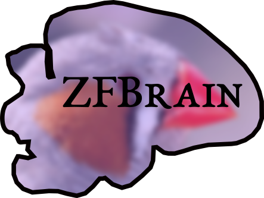

# ZFBrain

ZFBrain displays an interactive visualization of the Zebra Finch brain in 3D. The software presents the brain regions important for vocalization, including the HVC, RA, and Area X. It is intended to be used as an aid for researchers studying these brain regions. See the [documentation](https://zfbrain.readthedocs.io/en/latest/?badge=latest) for more info.

## Installation
ZFBrain can be installed through the "Releases" tab on the right, where you should download the release version that is compatible with your operating system. This software was developed for use on Windows, MacOS, and Linux.

## Screenshots
ZFBrain application in Windows:

## Contributing

Contributions to ZFBrain are welcome! See the [Developer Guide](https://zfbrain.readthedocs.io/en/latest/developerGuide.html) for info on how to contribute.
